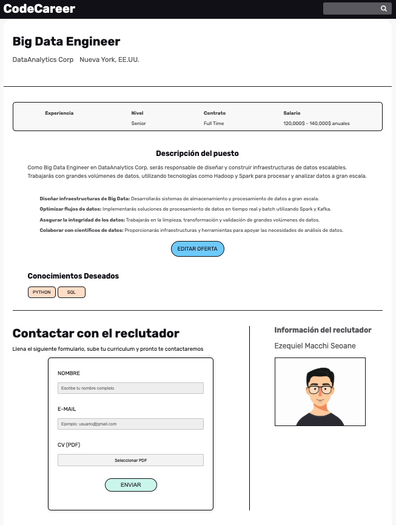
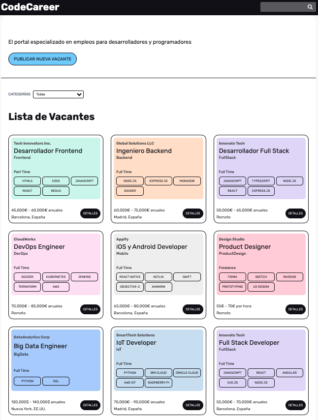

# CodeCareer


## 📄 Descripción

**CodeCareer** es una plataforma full stack orientada al mundo tech que conecta a desarrolladores y profesionales del sector con ofertas laborales publicadas por empresas y reclutadores. El sistema permite gestionar usuarios, vacantes, aplicaciones y perfiles, todo desde una misma interfaz intuitiva.

---

## 🌐 Demo

🔗 [code-career-render.onrender.com](https://code-career-render.onrender.com)


---

## 🖼️ Capturas




---

## ✨ Funcionalidades

- Registro y autenticación de usuarios con recuperación de contraseña
- Gestión de perfiles con subida de imagen y CV en PDF
- Publicación, edición y eliminación de vacantes por parte de reclutadores
- Aplicación de candidatos con almacenamiento de currículums
- Envío de notificaciones por email para acciones clave
- Diseño responsive y experiencia fluida sin recargas

---

## 🛠️ Tecnologías Utilizadas

### Backend

- **Node.js**
- **Express**
- **MongoDB + Mongoose**
- **Handlebars**
- **Passport.js**
- **Mailtrap (SMTP)**

### Frontend

- **Vanilla JS + Webpack**
- **Trix Editor**
- **CSS personalizado**
- **Handlebars Templates**

---

## 📋 Requisitos

- Node.js v18 o superior
- MongoDB Atlas (base de datos remota)
- Cuenta SMTP (Mailtrap o similar)
- Git

---

## 🧱 Estructura del Proyecto

```bash
CodeCareer/
├── config/             # Configuraciones (DB, Passport, Email)
├── controllers/        # Controladores con lógica de negocio
├── handlers/           # Lógica auxiliar (ej. envío de emails)
├── helpers/            # Funciones de ayuda para Handlebars
├── models/             # Modelos de datos Mongoose
├── public/             # Archivos estáticos (JS, CSS, imágenes, etc.)
├── routes/             # Definición de rutas de la aplicación
├── views/              # Vistas con Handlebars
├── variables.env       # Variables de entorno
├── index.js            # Punto de entrada del servidor
└── webpack.config.js   # Configuración de Webpack

```
---


## 🛠️ Instalación

```bash
git clone https://github.com/eze-ms/CodeCareer-NodeJs.git

```
---

© 2024. Proyecto desarrollado por Ezequiel Macchi Seoane

